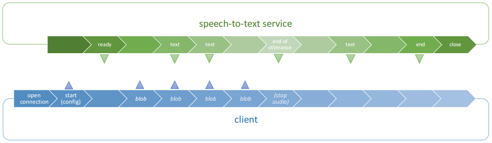

# SpeechToText Service

Based on Google Cloud Speech : https://cloud.google.com/speech

## Environment variables

This service can be configure by using environment variables (some of them are mandatory) :

Name         | Mandatory         | Default           | Example       | Description
------------ | ----------------- | ----------------- | ------------- | -------------
**GOOGLE_APPLICATION_CREDENTIALS** | `mandatory` | n/a | `/etc/somewhere/file.json` | path of the file to your security key. To get this key file, you will need to create an account and a project on the Google Cloud platform, later on you will be able to download the security key. [More details here](https://cloud.google.com/speech/docs/common/auth)
**PORT** | optional | `8080` | | port of the web server
**SECURITY_MODE** | optional | `none` | `none`, `oauth` | define the security applied during the connection. `oauth` requires an access token in the url, the other modes accept every connection
**SERVER_PATH** | optional | `/` | `/any/path` | custom path for the web server. e.g. `wss://server/any/path/`
**MAX_INACTIVITY** | optional | `4000` | | maximal amount of time before the service receive the audio data. If no audio data is received by the service, an event `end` is automatically sent (in milliseconds)
**DELAY_UNTIL_THE_END** | optional | `800` | | lapse between end of the voice (event `end-of-utterance`) and the real end of the session (event `end`) (in milliseconds)

## How to start ? (development)

```shell
npm install

export GOOGLE_APPLICATION_CREDENTIALS=/path/to/your/security.key

npm run start
```

## How to build and run ?


### Build it manually

```shell
npm install
npm run build

export GOOGLE_APPLICATION_CREDENTIALS=/path/to/your/security.key

# run the service
node dist/index.js
```

### Build it by using Docker (Jenkins)

```shell
export GOOGLE_APPLICATION_CREDENTIALS=/path/to/your/security.key

docker build .
```

## Workflow / Web Sockets

### Overview



### Messages

First of all, **a client needs to open a connection**. Then the conversation between the client and the service can
start (see the table below).

from client  | from service | Description
------------ | ------------ | ------------
`{ "type": "start", "config": {...} }` | | Send the settings required by the service (see details below)
 | `{ "type": "ready" }` | The service indicates it is ready to receive audio data (blob)
`BLOB` (binary) | | The client is sending **binary messages** (chunks of audio data)
 | `{ "type": "text", "text": "Hello" }` | The service is sending from time to time some texts during the session
 | `{ "type": "end-of-utterance" }` | The service has identified the end of the utterance (~the user stopped to speak)
 | `{ "type": "end", "text": "Hello World" }` | The service has finished to build the text. The last value is sent.

At the end of the session, the **server is automatically closing** the connection.

### Secured connection

When the **SECURITY_MODE** environment variable is defined with `oauth`, the connection will require an
`access_token` parameter in the link. For instance :

```javascript
// Opening a secured connection on the client side
const socket = new WebSocket("wss://server/?access_token=TOKEN");
```

### Configuration in the start message

The `start` message must contain a `config` field with required configurations.

```json
{
    "type" : "start",
    "config" : {
        "language": "en-US",
        "encoding": "LINEAR16",
        "sampleRate": 48000
    }
}
```

 * `language` : language code of the speaker, you can change the available values [here](https://cloud.google.com/speech/docs/languages).
 * `encoding` : audio encoding used to record the voice
 * `sampleRate` : audio sample rate used to record the voice

### Error handling

To catch every error, you should catch the Web Socket errors in the first place and also listen to the `error` messages.

```javascript
// Client / catch WebSocket errors
socket.onerror = function(error) {
    console.error('I have a bad feeling about this...', error);
};
```

```javascript
// Client / catch error messages
socket.onmessage = function(message) {
    const messageAsJson = parseTextMessage(message);

    if (messageAsJson.type === 'error') {
        console.error('I felt a great disturbance', messageAsJson.error);
    }
};
```